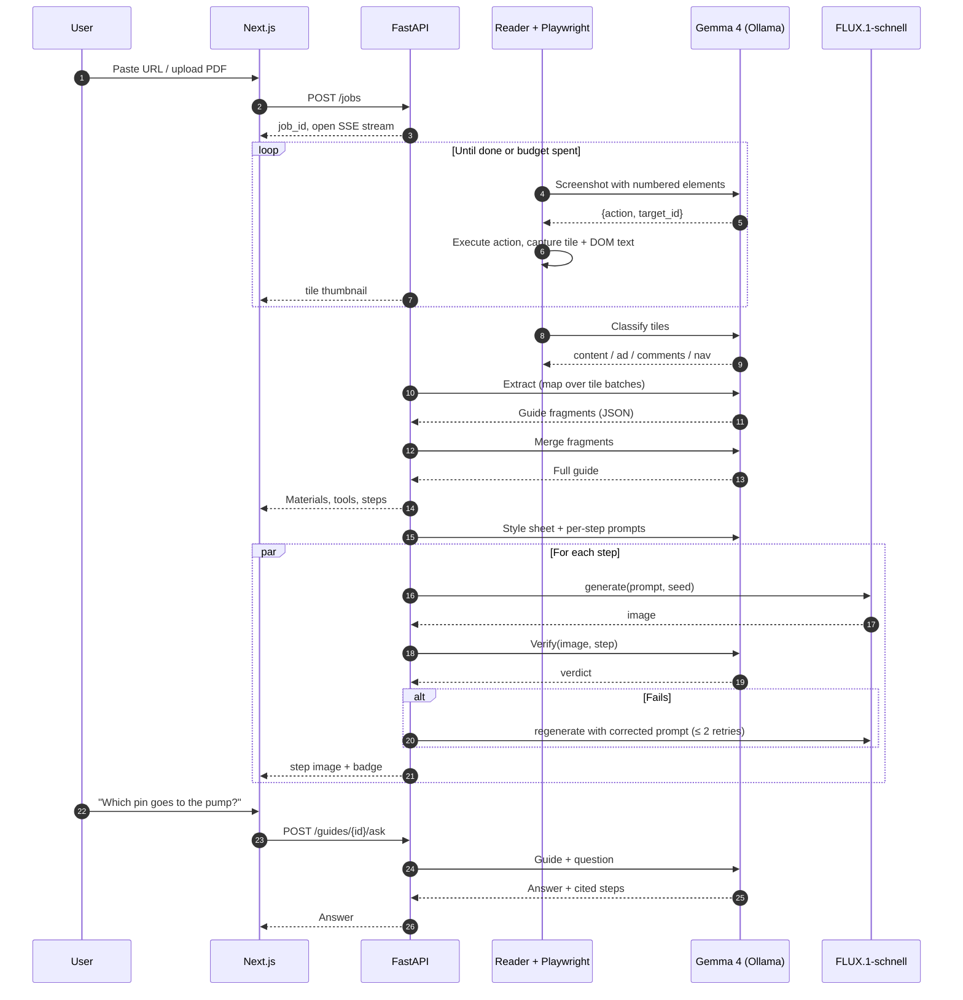
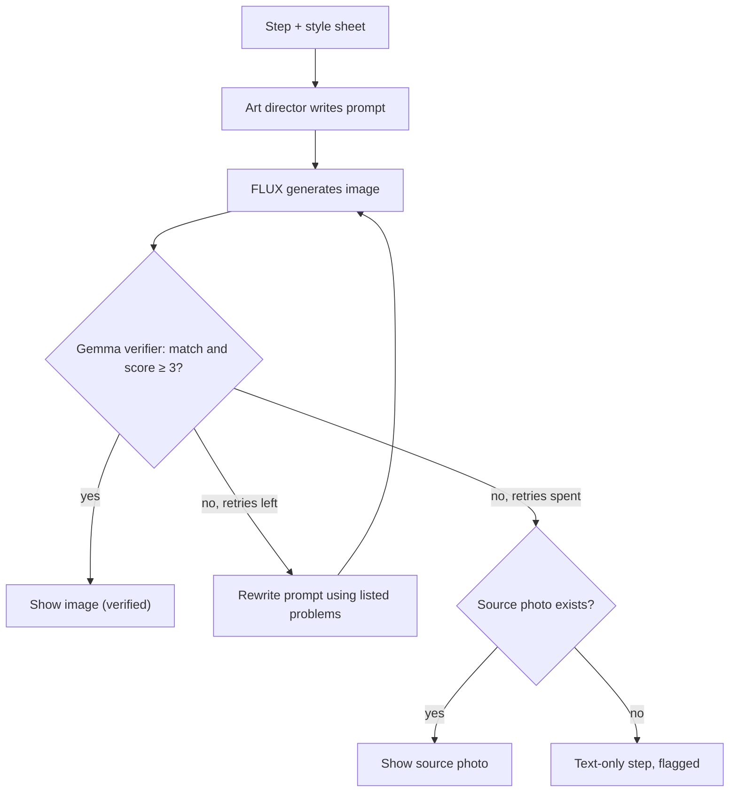

<h1 align="center">CraftGemma</h1>

<p align="center">
  <em>Any DIY guide, rebuilt as a clear visual walkthrough.</em>
</p>

<p align="center">
  
  
  
  
  
  
</p>

---

## Table of Contents

1. [Project Name](#1-project-name)
2. [Problem Statement](#2-problem-statement)
3. [Project Overview](#3-project-overview)
4. [Proposed Solution](#4-proposed-solution)
5. [Objectives](#5-objectives)
6. [Target Users / Use Case](#6-target-users--use-case)
7. [Open-Source AI Technology Selected](#7-open-source-ai-technology-selected)
8. [Why This Technology Was Selected](#8-why-this-technology-was-selected)
9. [AI's Role in the System](#9-ais-role-in-the-system)
10. [System Architecture](#10-system-architecture)
11. [Component-Level Architecture](#11-component-level-architecture)
12. [Data / Information Flow](#12-data--information-flow)
13. [Agentic Workflow](#13-agentic-workflow)
14. [Technology Stack](#14-technology-stack)
15. [Expected Features](#15-expected-features)
16. [Implementation Approach](#16-implementation-approach)
17. [Expected Final Output](#17-expected-final-output)
18. [Future Scope / Scalability](#18-future-scope--scalability)
19. [Open-Source Dependencies / Components](#19-open-source-dependencies--components)
20. [Expected Challenges and Mitigation](#20-expected-challenges-and-mitigation)

---

## 1. Project Name

**CraftGemma**: a Gemma 4 agent that reads any DIY guide (a web page or a PDF) the way a person does, by looking at it, and turns it into a clean, visual, step-by-step build guide with a generated illustration for every step.

---

## 2. Problem Statement

People who want to build something (a shelf, an Arduino weather station, a bird feeder, a cosplay prop) learn from guides scattered across the web and from PDF manuals. These guides are hard to follow:

- **Every site is formatted differently.** Instructables, personal blogs, wikiHow, maker forums, Hackaday posts and manufacturer PDFs all structure steps, materials and photos in their own way.
- **The useful content is buried.** Steps sit between ads, cookie banners, newsletter pop-ups, "read more" folds, comment threads and "continue on page 2" links.
- **Text and visuals don't line up.** A step says "attach the bracket to the left panel" while the nearest photo shows something else, or there is no photo at all.
- **Materials and tools are implicit.** You discover halfway through that you needed a 3 mm drill bit.
- **Safety notes are easy to miss.** Warnings about mains power, power tools or chemicals are often a single line in the middle of a paragraph.

Existing tools don't solve this. Reader modes strip pages to plain text and lose the photos and structure. Scrapers break on every site they weren't written for. Pasting a URL into a chat assistant gives a text summary with no step images and no check that the summary matches the page.

**The core problem:** there is no tool that turns *any* DIY source into a consistent, visual, step-by-step guide that stays faithful to the original.

---

## 3. Project Overview

CraftGemma takes a URL or a PDF and produces a structured build guide:

- project summary, difficulty and estimated time
- materials list and tools list
- ordered steps, each with clear instructions, the original source photo where one exists, and a **generated illustration** that shows the action
- safety warnings attached to the steps they belong to
- a grounded "ask about this step" panel that answers only from the guide, with step citations

The key design decision is that **CraftGemma reads pages visually.** A browser agent driven by Gemma 4 scrolls the page, takes screenshots, clears pop-ups, expands folded content and follows "next page" links. Gemma 4's vision then reads the screenshots together with the page's text. Because nothing depends on a site's HTML structure, the same pipeline works on any site and on scanned PDFs.

Every generated step image is **checked by Gemma 4 against the step text** before the user sees it. Images that don't match are regenerated with corrected prompts, or replaced with the original source photo.

<p align="center">
  
</p>

<p align="center"><sub>Blue: Gemma 4. Orange: image generation. Purple: user input and output.</sub></p>

---

## 4. Proposed Solution

CraftGemma is a pipeline of five stages, all coordinated by Gemma 4 E4B running locally through Ollama.

| Stage | What happens | Gemma 4's job |
|---|---|---|
| **1. Read** | A Playwright browser opens the URL (or a PDF is rendered page by page). An agent loop scrolls and interacts until the guide is fully visible, and captures screenshot tiles plus the matching text. | Looks at each screenshot and decides the next browser action: scroll, dismiss a pop-up, expand "read more", go to the next page, or stop. |
| **2. Filter** | Tiles are labelled as guide content, ad, comments or navigation. Only content is kept. | Classifies each tile visually. |
| **3. Extract** | Content tiles become a structured guide: materials, tools, steps, warnings, source-photo assignments. | Reads the tiles (image plus text) and fills a strict JSON schema. A merge pass joins steps that span tiles. |
| **4. Illustrate** | A per-project visual "style sheet" is written from the hero photo. Each step gets an image prompt, and FLUX.1-schnell generates the illustration. | Writes the style sheet and the per-step prompts. |
| **5. Verify** | Each generated image is compared with its step. Failures are retried with a corrected prompt, then fall back to the source photo. | Looks at the generated image and the step text, and returns a match verdict with specific problems. |

Results stream to the Next.js frontend as they are produced. The user sees the text steps within the first minute, and the illustrations fill in one by one.

---

## 5. Objectives

1. **Site-agnostic reading.** Turn guides from at least six different sites, plus PDF manuals, into the same structured format, with no per-site code.
2. **Faithful extraction.** Steps, materials and tools must come from the source, not be invented. Target: ≥ 90% step recall and ≥ 85% materials F1 on our labelled test set.
3. **Images that match the step.** Every image shown to the user has passed Gemma 4's verification, or is the source's own photo.
4. **Fast first result.** Text steps visible in under 60 seconds for a typical single-page guide on a consumer GPU laptop.
5. **Local intelligence.** All reading, reasoning and verification run on Gemma 4 locally. Image generation uses an open-weight model behind an adapter, so where it runs is a deployment choice, not a design change.
6. **Measured, not claimed.** Ship a reproducible evaluation script and report the results.

---

## 6. Target Users / Use Case

**Primary users**

| User | What they need |
|---|---|
| **Hobbyist makers and DIYers** | Follow a guide from any site without fighting its layout. See what each step should look like. |
| **Students in maker labs, robotics and STEM clubs** | Turn a long blog post or PDF lab guide into a clear checklist they can work through at the bench. |
| **Teachers and workshop leaders** | Convert a found guide into a consistent handout for a class. |
| **People assembling products** | Turn a dense PDF assembly or repair manual into a visual sequence. |

**Example use case**

> Priya finds a blog post for building a plant-watering system with an ESP32. The post is long and has ads between every paragraph. Its steps are spread across two pages, and half of them have no photo. She pastes the link into CraftGemma. In under a minute she has a materials list (ESP32, soil moisture sensor, 5V pump, relay module…), a tools list, and 11 numbered steps. A warning sits pinned to the step where the pump connects to power. Over the next minute, an illustration appears beside each step. Two images are visibly marked "regenerated after check". At step 7 she asks "which relay pin goes to the pump?" and gets an answer quoting step 7 of the source.

---

## 7. Open-Source AI Technology Selected

| Component | Role in CraftGemma | License |
|---|---|---|
| **Gemma 4 E4B (instruction-tuned)**, Google | The core intelligence: browser-agent decisions, tile classification, structured extraction, prompt writing, image verification, grounded Q&A | Apache 2.0 |
| **Gemma 4 E2B** | Fallback for 4–6 GB VRAM laptops and for the cheaper tile-classification step | Apache 2.0 |
| **FLUX.1-schnell**, Black Forest Labs | Step-illustration generation (open-weight model behind an image adapter) | Apache 2.0 |
| **Ollama** | Local inference server for Gemma 4, with structured (JSON-schema) outputs | MIT |
| **Playwright** | Headless browser the agent controls | Apache 2.0 |

Gemma 4 is the only reasoning model in the system. Without it, the product has no way to read pages, decide actions, extract the guide or check images.

---

## 8. Why This Technology Was Selected

**Why Gemma 4 E4B specifically**

- **It sees.** Gemma 4 E4B accepts images natively. Reading screenshots is what makes CraftGemma site-agnostic, so a text-only model would put us back to writing per-site scrapers.
- **It fits the hardware we have.** E4B is built for laptops and edge devices. A quantized E4B fits on the 4–8 GB VRAM GPU laptops our team will build and demo on. A larger multimodal model would not.
- **It follows schemas.** Every Gemma call in CraftGemma returns structured data (an action, a label, a guide, a verdict). Gemma 4 supports structured tool use, and Ollama can constrain output to a JSON schema. That combination makes a small model dependable inside a pipeline.
- **Long context.** The 128K context window holds a whole extracted guide, so grounded Q&A can include the full guide in the prompt without a vector database.
- **Apache 2.0.** We can ship CraftGemma as open source with no usage restrictions passed on to users.

**Why run it locally**

- **Cost.** One guide needs dozens of vision calls: agent steps, tile labels, extraction and one verification per image. Running locally makes the marginal cost zero, so verify-and-retry loops are affordable.
- **The pages are untrusted.** Web pages can contain prompt-injection text. A local model with a narrow, schema-constrained job, and no access to user accounts or secrets, limits what such text can do.
- **Reproducibility.** Judges and contributors can run the exact same model and get the same behaviour.

**Why FLUX.1-schnell, behind an adapter**

- FLUX.1-schnell is open-weight under Apache 2.0 and produces good images in 1–4 sampling steps, which keeps per-step generation fast enough for retries.
- Image generation is the heaviest workload in the system. We call it through a small adapter interface (`generate(prompt, seed, size)`), so the same code works whether FLUX runs on the Gemma laptop, on a second GPU machine, or on a quantized build. We will choose the deployment based on the compute available at the final. No proprietary model is involved.

**Alternatives considered**

| Option | Why not |
|---|---|
| Site-specific scrapers + text LLM | Breaks on every new site and ignores what the page shows visually. |
| Larger open VLMs (e.g. Gemma 4 26B/31B) | Don't fit in 4–8 GB VRAM. E4B is enough for reading and verification when outputs are schema-constrained. |
| Hosted proprietary VLM APIs | Against the spirit of the track, makes every verification call cost money, and sends untrusted pages to a third party. |
| Classic OCR (e.g. Tesseract) only | Reads text but can't tell an ad from a step, can't judge whether a photo matches a step, and can't drive the browser. |

---

## 9. AI's Role in the System

Gemma 4 is used in six distinct roles. Each role has its own prompt, schema and failure handling.

| # | Role | Input | Output (schema-constrained) |
|---|---|---|---|
| 1 | **Navigator** | Screenshot with numbered boxes over clickable elements, plus scroll position | `{action, target_id?, reason}` with action ∈ `scroll`, `click`, `dismiss`, `next_page`, `done` |
| 2 | **Tile classifier** | One screenshot tile | `{label: content \| ad \| comments \| navigation \| other}` |
| 3 | **Extractor** | Content tiles (image + DOM text) in reading order | Partial guide JSON per tile batch, then a merged guide |
| 4 | **Art director** | Hero photo + extracted guide | Project style sheet + one image prompt per step |
| 5 | **Verifier** | Generated image + step text + style sheet | `{match: bool, score: 1–5, problems: [..]}` |
| 6 | **Guide assistant** | Full guide JSON + user question | Answer with cited step numbers, or "not in this guide" |

The surrounding code is deterministic. It runs the browser, deduplicates tiles, validates schemas, orders steps, manages retries and stores results. AI makes the judgement calls, and code enforces the structure.

---

## 10. System Architecture

<p align="center">
  
</p>

<p align="center"><sub>Blue: Gemma 4. Yellow: deterministic code. Green: storage. Orange: image generation. Purple: user and frontend.</sub></p>

**Deployment:** the backend, Ollama and the frontend run on one GPU laptop and start with a single `docker compose up`. FLUX runs wherever the available compute allows; the image adapter is configured with its address.

---

## 11. Component-Level Architecture

### 11.1 Frontend (Next.js)

- **Input page:** paste a URL or upload a PDF.
- **Live build view:** subscribes to the job's server-sent events (SSE) stream. Shows the reading progress with screenshot thumbnails as the agent scrolls, then steps as they are extracted, then images as they pass verification.
- **Guide view:** materials and tools checklists, numbered steps with source photo and illustration side by side, safety callouts, and a per-step "ask" box.
- **Verification badges:** each image shows "verified", "regenerated after check" or "source photo".
- **Export:** Markdown and printable PDF.

### 11.2 API and job orchestrator (FastAPI)

- `POST /jobs` creates a job from a URL or uploaded PDF. `GET /jobs/{id}/events` streams progress. `GET /guides/{id}` returns the guide JSON. `POST /guides/{id}/ask` handles Q&A.
- Jobs run as asyncio tasks with a fixed concurrency limit so the GPU is never oversubscribed. Each stage writes its output to SQLite before the next starts, so a crashed job resumes from the last finished stage.

### 11.3 Reader

**Web pages (Playwright + Gemma Navigator)**

1. Open the page at a fixed viewport (1280×900).
2. Collect visible clickable elements from the DOM and draw numbered boxes over them on the screenshot (the "set-of-marks" technique). Gemma chooses an element by number instead of guessing pixel coordinates, which is far more reliable for a small model.
3. Ask the Navigator for one action, execute it, and capture the new viewport as a tile with its DOM text (extracted with trafilatura).
4. Stop when the Navigator says `done`, the scroll position stops changing, or the step budget (default 40 actions) runs out.
5. Deduplicate overlapping tiles with perceptual hashing.
6. Collect `` elements inside content tiles as candidate source photos.

**PDFs (pypdfium2)**

- Render each page to an image and pull its text layer if present.
- Scanned pages without a text layer are read by Gemma's vision alone. The rest of the pipeline is identical.

### 11.4 Tile classifier

- Runs on E2B when two models fit in memory, otherwise on E4B.
- Drops ads, comment sections and navigation before extraction. This cuts extraction time and stops comments ("I used 4 screws instead!") from leaking into the steps.

### 11.5 Extractor

- **Map step:** tiles are processed in batches of 2–3 (images plus their DOM text). Each batch produces a partial guide fragment against a Pydantic schema enforced by Ollama's JSON-schema output.
- **Reduce step:** fragments are merged. Steps split across a tile boundary are joined, duplicates are removed, numbering is fixed, and materials and tools are deduplicated and normalised (e.g. "M3 screws ×4").
- **Grounding rule:** every step must carry the IDs of the tiles it came from. A step with no supporting tile is dropped. Step text is checked for overlap with the DOM text of its tiles. Low-overlap steps are flagged for a second extraction pass instead of being shown as-is.

**Guide schema (abridged)**

```json
{
  "title": "ESP32 Plant Watering System",
  "summary": "Automatically water a pot plant when the soil gets dry.",
  "difficulty": "intermediate",
  "estimated_time_minutes": 120,
  "materials": [{ "name": "ESP32 dev board", "quantity": "1" }],
  "tools": [{ "name": "Soldering iron" }],
  "steps": [
    {
      "number": 4,
      "title": "Wire the relay to the pump",
      "instructions": "Connect the relay's NO terminal to the pump's positive lead...",
      "warnings": ["Disconnect the 5V supply before wiring."],
      "source_tiles": [6, 7],
      "source_photo": "photos/img_12.jpg",
      "illustration": {
        "path": "images/step_4_v2.png",
        "status": "regenerated",
        "verifier_score": 4
      }
    }
  ],
  "source": { "type": "url", "value": "https://example.com/plant-waterer" }
}
```

### 11.6 Art director

- Writes a **project style sheet** from the hero photo, for example: "matte white 3D-printed enclosure, green PCB, red and black jumper wires, wooden workbench, soft daylight, photographic". The style sheet is included in every image prompt.
- Writes one prompt per step describing the action, the visible parts and the camera framing (close-up of hands, top-down, exploded view).
- Uses a fixed random seed per project, so lighting and objects stay consistent across steps.

### 11.7 Image adapter

- A single interface `generate(prompt, seed, size) -> image` in front of FLUX.1-schnell. The backend behind it (diffusers, ComfyUI or another FLUX server) is set in config.
- Runs up to N requests concurrently (configurable), with timeouts and exponential back-off.

### 11.8 Verifier

- Gemma looks at the generated image, the step text and the style sheet, then returns a verdict with concrete problems ("shows a screwdriver; step says soldering iron", "two boards visible; there is one").
- **Retry policy:** if score < 3 or `match` is false, the art director rewrites the prompt with the listed problems and the image is regenerated. Two retries at most.
- **Fallback:** after two failures, the step shows its source photo if one exists. Otherwise it shows the text step alone with a "no reliable illustration" note. Images that fail verification are never shown as if they were correct.

### 11.9 Guide assistant

- The whole guide JSON goes in the prompt. Guides are a few thousand tokens, far below the 128K context, so no vector store is needed.
- The answer schema requires cited step numbers. If the answer isn't in the guide, the assistant must say so instead of guessing.

### 11.10 Storage

- **SQLite:** jobs, stage status, guides, verifier verdicts, timings.
- **File store:** tiles, source photos, generated images, exports.

---

## 12. Data / Information Flow



**What goes to the image model:** only short image prompts written by the art director. Page screenshots, page text and user questions never leave the Gemma side of the system.

---

## 13. Agentic Workflow

CraftGemma has two agent loops. Both are bounded, observable and recoverable.

### 13.1 Reading agent

<p align="center">
  
</p>

**Guardrails**

- **Domain lock:** `next_page` may only follow links on the same domain. Any other click requires the URL to stay within that domain.
- **Action whitelist:** no typing, form submission, downloads or logins.
- **Budget:** at most 40 actions and 120 seconds per page.
- **Stuck detection:** if the same action repeats three times with no change in the page, the loop stops.
- **Injection resistance:** the Navigator can only return the action schema, so any instructions in page text cannot do anything outside these actions.

### 13.2 Illustrate-and-verify agent



Every decision (actions, verdicts, retries) is logged and visible in the UI's "how this guide was built" panel. That panel doubles as our debugging view and as part of the demo.

---

## 14. Technology Stack

| Layer | Technology | Why |
|---|---|---|
| Frontend | Next.js (App Router), React, Tailwind CSS | Fast to build; streaming UI via SSE |
| Backend | Python, FastAPI, Pydantic, asyncio | Async jobs, strict schemas shared with the model's output |
| Model serving | Ollama | Simple local serving of Gemma 4 with JSON-schema outputs; OpenAI-compatible API |
| Core model | Gemma 4 E4B-it (quantized); E2B-it as fallback | Vision + structured output on a 4–8 GB GPU |
| Image model | FLUX.1-schnell behind an adapter | Open-weight, fast, good quality; deployment set by available compute |
| Browser automation | Playwright (Chromium) | Reliable headless browsing, screenshots, element boxes |
| Page text | trafilatura | Clean main-text extraction to ground the vision model |
| PDF | pypdfium2 | Page rendering and text layer, permissive license |
| Image utilities | Pillow, imagehash | Set-of-marks overlays, tile deduplication |
| Storage | SQLite, local filesystem | Zero setup; enough for single-machine use |
| Packaging | Docker Compose | One-command start for judges and contributors |
| Evaluation | Python script + labelled JSON set | Reproducible metrics |

---

## 15. Expected Features

**Core (must ship at the final)**

- [ ] Paste any DIY URL, or upload a PDF
- [ ] Gemma-driven browsing: scroll, dismiss pop-ups, expand folds, follow "next page"
- [ ] Ad, comment and navigation filtering
- [ ] Structured guide: summary, difficulty, time, materials, tools, steps, warnings
- [ ] Source photos matched to steps
- [ ] Generated illustration per step, kept consistent by a shared style sheet and seed
- [ ] Gemma verification of every image, with retry and fallback
- [ ] Live streaming build view
- [ ] Grounded per-step Q&A with citations
- [ ] "How this guide was built" log panel
- [ ] Evaluation script with reported metrics

**Stretch (if time allows)**

- [ ] Markdown and printable PDF export
- [ ] Shopping list grouped by materials and tools, with checkboxes
- [ ] Shared cache: the same URL returns the stored guide instantly

---

## 16. Implementation Approach

### 16.1 Team split (3 people)

| Person | Owns |
|---|---|
| A: Agent and model | Ollama setup, Navigator, classifier, extractor prompts and schemas, verifier |
| B: Backend | FastAPI jobs, orchestrator, Playwright plumbing, PDF reader, image adapter, storage, SSE |
| C: Frontend and evaluation | Next.js build view and guide view, Q&A panel, log panel, evaluation script and test set |

With two people, A and B merge and C stays the same.

### 16.2 Build plan for the final

| Block | Goal | Done when |
|---|---|---|
| 0. Setup | Repo, Docker Compose, Ollama with Gemma 4 E4B, Playwright, FLUX key | `docker compose up` serves a hello page and a Gemma call returns JSON |
| 1. Reader | Navigator loop with set-of-marks, tiles, dedupe; PDF rendering | Five different sites produce clean tile sets |
| 2. Extract | Classifier, map-reduce extraction, grounding checks | A guide JSON validates for each test page |
| 3. Stream UI | SSE events; steps render live | Steps appear in the browser as they are produced |
| 4. Illustrate | Style sheet, prompts, FLUX adapter | Every step has an image |
| 5. Verify | Verifier, retries, fallback, badges | Mismatched images are visibly caught and replaced |
| 6. Q&A + log | Grounded Q&A, build-log panel | Questions answered with step citations |
| 7. Evaluate + polish | Run metrics, fix the worst failure mode, prepare demo URLs | Metrics table filled in; demo rehearsed twice |

Blocks 1–2 (backend and agent) and block 3 (frontend, against a mocked event stream) run in parallel from the start.

### 16.3 Evaluation method

- **Test set:** about 30 web guides across at least six sites (Instructables, wikiHow, Hackaday.io, personal blogs, maker forums, manufacturer pages), plus about 10 PDF manuals, a few of them scanned. Each is labelled by hand with its true step list, materials and tools.
- **Metrics:**

| Metric | How it's measured | Target |
|---|---|---|
| Step recall | Labelled steps matched by an extracted step (fuzzy text match + manual check) | ≥ 90% |
| Step precision | Extracted steps that correspond to a real step | ≥ 90% |
| Materials / tools F1 | Normalised item matching | ≥ 85% |
| Ad/comment leakage | Extracted steps that came from non-content tiles | ≤ 2% |
| Verifier agreement | Agreement between Gemma's verdict and a human verdict on 100 images | ≥ 80% |
| Time to first step | Job start → first step on screen | < 60 s |
| Time to full guide | Job start → all images settled | < 3 min for a 10-step guide |

- **Baseline:** the same pages run through text-only extraction (trafilatura text → Gemma, no vision, no agent), so we can show what vision-based reading adds.

---

## 17. Expected Final Output

1. **A working web app.** A judge pastes a DIY link of their choice or uploads a PDF manual. They watch the agent read the page, see the steps appear, then watch illustrations fill in, including at least one image that the verifier rejects and replaces.
2. **A public GitHub repository** under Apache 2.0 with source, Docker Compose setup, model setup instructions, and the evaluation script with its labelled test set.
3. **An evaluation report** with the metrics table from 16.3 filled in, compared against the text-only baseline.
4. **A short architecture walkthrough** using the diagrams in this README, updated to match what was built.

---

## 18. Future Scope / Scalability

**Product**

- **Video guides:** read YouTube or uploaded DIY videos by sampling frames for Gemma's vision and using transcripts for text, then feed the same extract-illustrate-verify pipeline.
- **Repair manuals and right-to-repair:** device teardown and repair guides, with part numbers linked to suppliers.
- **Translation:** produce the guide in the user's language for classrooms that don't work in English.
- **Bench mode:** a hands-free, large-text step view for following along at the workbench.

**Technical**

- **Local image generation:** point the image adapter at a local FLUX or other open model on machines with more VRAM, making the whole system offline.
- **Fine-tuned extractor:** use the labelled set and the verifier logs to LoRA-fine-tune Gemma 4 E4B on guide extraction, then measure the gain with the same evaluation script.
- **Scale-out:** move jobs to a queue (Redis + workers) with several Ollama or vLLM workers. Stages are already independent and resumable.
- **Shared guide cache:** popular guides are built once and served to everyone. Results are keyed by URL and content hash, so a changed page triggers a rebuild.
- **API and plugins:** expose `POST /guides` so other tools (a maker-space wiki, a classroom LMS) can create guides programmatically.

---

## 19. Open-Source Dependencies / Components

| Component | Purpose | License |
|---|---|---|
| [Gemma 4](https://ai.google.dev/gemma) (E4B-it, E2B-it) | Core multimodal model | Apache 2.0 |
| [FLUX.1-schnell](https://huggingface.co/black-forest-labs/FLUX.1-schnell) | Step illustrations | Apache 2.0 |
| [Ollama](https://github.com/ollama/ollama) | Local model server | MIT |
| [Playwright](https://github.com/microsoft/playwright-python) | Browser automation | Apache 2.0 |
| [FastAPI](https://github.com/fastapi/fastapi) | Backend API | MIT |
| [Pydantic](https://github.com/pydantic/pydantic) | Schemas and validation | MIT |
| [trafilatura](https://github.com/adbar/trafilatura) | Main-text extraction | Apache 2.0 |
| [pypdfium2](https://github.com/pypdfium2-team/pypdfium2) | PDF rendering and text | Apache 2.0 / BSD-3 |
| [Pillow](https://github.com/python-pillow/Pillow) | Image processing | MIT-CMU |
| [ImageHash](https://github.com/JohannesBuchner/imagehash) | Perceptual tile deduplication | BSD-2 |
| [Next.js](https://github.com/vercel/next.js) | Frontend | MIT |
| [Tailwind CSS](https://github.com/tailwindlabs/tailwindcss) | Styling | MIT |
| [SQLite](https://sqlite.org) | Storage | Public domain |
| [Docker Compose](https://github.com/docker/compose) | Packaging | Apache 2.0 |

Every model and library in the system is open source or open-weight.

---

## 20. Expected Challenges and Mitigation

| Challenge | Risk | Mitigation |
|---|---|---|
| **Small model makes wrong browser decisions** | Agent loops, clicks ads, or stops early | Set-of-marks numbered targets instead of coordinates; strict action schema; domain lock; budget and stuck detection; full-page scroll capture as a fallback if the agent gives up |
| **Extraction hallucinates steps or materials** | Guide no longer matches the source | Every step must cite source tiles; overlap check against DOM text; low-overlap steps re-extracted; measured by step precision in evaluation |
| **Generated images don't match steps** | Misleading guide | Gemma verifier on every image; up to two corrected retries; fall back to source photo or text-only; badges show which is which |
| **Inconsistent look across step images** | Guide looks stitched together | Shared style sheet from the hero photo; fixed seed per project; framing vocabulary in prompts |
| **VRAM limits (4–8 GB)** | Gemma 4 E4B doesn't fit or is slow | Quantized E4B; E2B for classification and as full fallback; FLUX can run on a separate machine behind the image adapter; one GPU job at a time via the orchestrator |
| **Slow end-to-end time** | Demo drags | Stream results stage by stage; classify tiles before extraction to cut tokens; generate images concurrently; text steps shown before images |
| **Pop-ups, paywalls, bot protection** | Page can't be read | Navigator's `dismiss` action handles most pop-ups; a hard block is reported to the user with a suggestion to upload a PDF or "print to PDF" version instead |
| **Prompt injection in page content** | Page text tries to steer the agent | Schema-only outputs; no typing, forms or logins; no secrets in the agent's context; domain lock |
| **Copyright of source content** | Republishing others' guides | CraftGemma is a personal reading tool: it always links the source, credits the author, keeps source photos attributed, and does not publish guides publicly by default |
| **Image generation slow or unavailable** | No illustrations | Retries with back-off; a lower step count or smaller resolution when the GPU is busy; the guide is still fully usable with source photos and text |
| **Hackathon time** | Not everything gets built | Features split into core and stretch (section 15); frontend built against a mocked event stream from the start, so integration isn't a last-minute risk |

---

<p align="center"><sub>CraftGemma: Hacktober Fest Open Source AI Hackathon qualifier proposal. Implementation will be built during the final hackathon and released under Apache 2.0.</sub></p>
